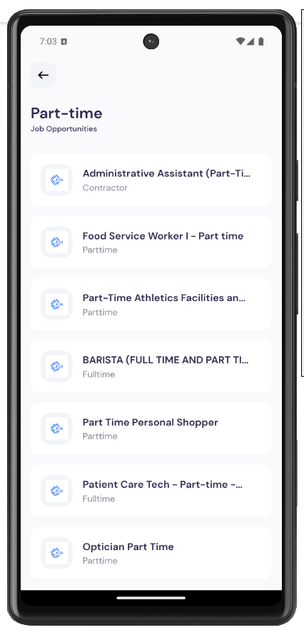

### Screenshot of the App




# Expo Router Example

Use [`expo-router`](https://expo.github.io/router) to build native navigation using files in the `app/` directory.

## 🚀 How to use

```sh
npx create-expo-app -e with-router
```

## 📝 Notes

- [Expo Router: Docs](https://expo.github.io/router)
- [Expo Router: Repo](https://github.com/expo/router)

  <!-- create a build and see the demo -->

  <!-- sudo npx expo start --tunnel -->

---

Why use Expo Dev

Expo is a free and open-source platform for building native iOS and Android apps using JavaScript and React.

It provides tools and services that allow developers to quickly create and deploy mobile applications without needing to write separate codebases for each platform.

Expo enables developers to build and test their apps using a single codebase that runs on both iOS and Android devices.

It abstracts away some of the complexities involved in the development process by providing a unified workflow, access to various native APIs through JavaScript, and a development environment that allows for rapid iteration and testing.

Expo allows you to create cross-platform apps that can be deployed to both the Apple App Store and Google Play Store.

Big companies like Bloomberg, Shopify, and Coinbase are using React Native for their mobile apps. Coinbase started with native and moved to React Native with great success. You can find more companies listed in the React Native documentation!

how react native work in web?

Platform-Specific Components: While many components can be shared between mobile and web platforms, there are some platform-specific differences. React Native for Web handles these differences by providing web-specific implementations for certain components or functionalities where necessary.

For instance, components like View might render as div elements in web contexts.

What is in react Native

View Component as div
Text Component as <p> or <h> tag

TouchableOpacity : For creating a custom buttons

    use <TouchableOpacity> component

ActivityIndicator : used for showing spinner or loading indicator in your app.

Flatlist :

which is use for rendering a long list of items that need to be scrolled efficiently it’s like the map function in react.

Extra feature of flatlist is :

    optimized scroll performance
        itme separation

But when to use a FlateList and map in react native :

FlatList for : Larger list with smooth scrolling.

map for : Smaller list.

ScrollView :

it is a like a magic box that can hold a multiple components and views, Providing a scrolling container for them.

It’s like a overflow : scroll in html

same in ScrollView as scroll functionality.

SafeAreaView :

it provides a safe zone to render your app’s content without being covered by the device’s hardware features like the notch , home indicator ,status

that ensure that content is displyed within the visible area , making your app more accessible.

Expo Router : - is a file-based router for React Native and web applications.

It allows you to manage navigation between screens in your app, allowing users to move seamlessly between different parts of your app's UI, using the same components on multiple platforms (Android, iOS, and web).

What is React Native Reanimated?

React Native Reanimated is a powerful animation library built by Software Mansion.

With Reanimated, you can easily create smooth animations and interactions that run on the UI thread.

Comparison of React with React Native :

onPress event same as onClick in react

React Native TouchableOpacity

The TouchableOpacity wrapper is used to reduce the opacity of button. It allows background to be seen while the user press down. The opacity of button will be controlled by wrapping the children in an Animation.

Image Component Contains parameters such as
=> source={{ uri: url_link  }} like src in react

npx create-expo-app@latest -e with-router

Video For Reference :-

To Upload a Build into a Android.

https://youtu.be/oBWBDaqNuws?si=2bC7yoSd2b_1PcSz

Commad For Build :

eas build --platform android

eas submit -p android --latest
